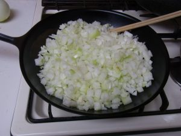
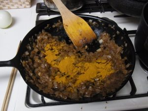
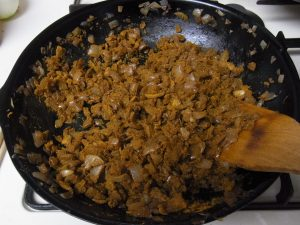

# 炒め玉ねぎをベースとしてカレー粉（スパイスミックス）を使った油分少なめのカレーです。

１．フライパンで、玉ねぎを３０分～１時間ほど炒める。
（玉ねぎ大４個／８食分、オリーブオイル大匙１）

２．玉ねぎがきつね色になるまで炒め、

３．カレー粉を入れて（カレー粉大匙１）

４．混ぜる。

５．玉ねぎを鍋に移し、同じフライパンをそのまま使って肉を炒め、カレー粉をまぶす。
（カレー粉大匙１、鶏肉適当量）

６．肉を鍋に入れ、トマト缶、スープの素、カレー粉、ウスターソース、ケチャップなどを入れる。（カレー粉大匙１）

７．具として、玉ねぎ、キノコ類など入れ、３０分ほど焦げ付かないように煮込む。

８．味を確認し、必要ならカレー粉を追加し、最後にガラムマサラを追加。

